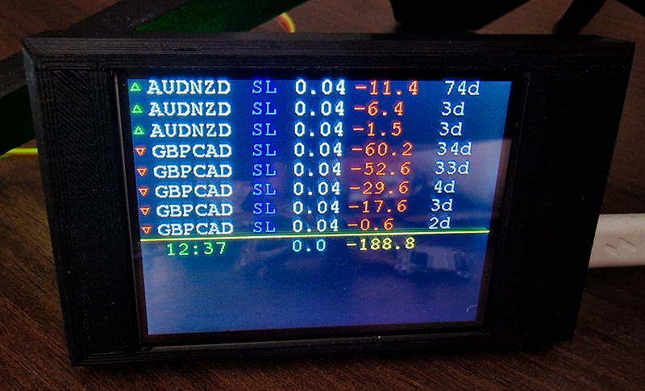

# Forex ESP32 MQTT TFT Expert data exchange.

Connect to Metatrader 4 Expert by MQTT, receive data through the python bridge and MQTT, and display on the screen TFT every x seconds. 


## In my case is 2 config, TFT

``` C++

```

Next implementation tasks:
- [x] Touch screen for On/Off backlight.
- [x] Buzzer play then any order is positive.
- [x] Button for On/Off buzzer.
- [x] Screen Off in WeekEnd and in night time.
- [ ] AP WiFi Portal.
- [ ] WebServer View Forex data.
- [ ] Time Sync and scenaries.
- [ ] Send data to Home Assistant.
- [ ] WebSerial control. Send "cmd" to view commands. 


